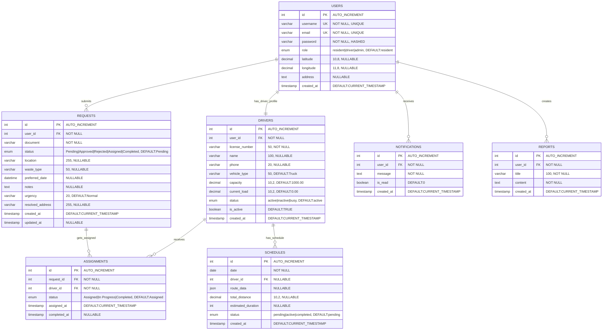

# DRMS Database Entity Relationship Diagram (ERD)

## 1. Complete ERD Overview



## 2. Detailed Entity Descriptions

### 2.1 USERS Entity
**Purpose**: Central user management for all system participants

**Key Attributes**:
- `id`: Primary key, auto-incrementing unique identifier
- `username`: Unique username for login (50 characters max)
- `email`: Unique email address (100 characters max)
- `password`: Hashed password using bcrypt (255 characters)
- `role`: User role with three possible values (resident, driver, admin)
- `latitude/longitude`: Geographic coordinates for location-based services
- `address`: Full text address for service location
- `created_at`: Timestamp of account creation

**Constraints**:
- Username and email must be unique
- Password is required and hashed
- Role defaults to 'resident' if not specified
- Geographic coordinates are optional but recommended for residents

### 2.2 REQUESTS Entity
**Purpose**: Core business entity for waste collection requests

**Key Attributes**:
- `id`: Primary key, auto-incrementing unique identifier
- `user_id`: Foreign key to USERS table (resident who submitted request)
- `document`: Description of the request (100 characters)
- `status`: Current status in the request lifecycle
- `location`: Service location address (255 characters)
- `waste_type`: Type of waste to be collected (50 characters)
- `preferred_date`: Preferred collection date and time
- `notes`: Additional notes or special instructions
- `urgency`: Priority level (Normal, High, Emergency)
- `resolved_address`: Geocoded address for mapping
- `created_at/updated_at`: Timestamps for tracking

**Status Lifecycle**:
```
Pending → Approved/Rejected → Assigned → Completed
```

### 2.3 DRIVERS Entity
**Purpose**: Driver profiles and capacity management

**Key Attributes**:
- `id`: Primary key, auto-incrementing unique identifier
- `user_id`: Foreign key to USERS table (one-to-one relationship)
- `license_number`: Driver's license number (50 characters, required)
- `name`: Driver's full name (100 characters)
- `phone`: Contact phone number (20 characters)
- `vehicle_type`: Type of vehicle (default: Truck)
- `capacity`: Maximum load capacity in kg (default: 1000.00)
- `current_load`: Current load in kg (default: 0.00)
- `status`: Driver availability status
- `is_active`: Boolean flag for active/inactive drivers

**Status Values**:
- `active`: Available for assignments
- `inactive`: Not available (off duty)
- `busy`: Currently on assignment

### 2.4 ASSIGNMENTS Entity
**Purpose**: Linking requests to drivers for task execution

**Key Attributes**:
- `id`: Primary key, auto-incrementing unique identifier
- `request_id`: Foreign key to REQUESTS table
- `driver_id`: Foreign key to DRIVERS table
- `status`: Assignment status tracking
- `assigned_at`: Timestamp when assignment was created
- `completed_at`: Timestamp when task was completed

**Status Values**:
- `Assigned`: Task assigned but not started
- `In Progress`: Driver is currently working on the task
- `Completed`: Task has been completed

### 2.5 SCHEDULES Entity
**Purpose**: Optimized route schedules for drivers

**Key Attributes**:
- `id`: Primary key, auto-incrementing unique identifier
- `date`: Schedule date
- `driver_id`: Foreign key to DRIVERS table (nullable for unassigned schedules)
- `route_data`: JSON data containing optimized route information
- `total_distance`: Total route distance in kilometers
- `estimated_duration`: Estimated completion time in minutes
- `status`: Schedule status

**Route Data Structure** (JSON):
```json
{
  "stops": [
    {
      "request_id": 123,
      "address": "123 Main St",
      "coordinates": {"lat": 40.7128, "lng": -74.0060},
      "estimated_time": "09:30",
      "waste_type": "General",
      "customer_name": "John Doe"
    }
  ],
  "optimization_metrics": {
    "fuel_savings": 25.5,
    "time_savings": 45,
    "efficiency_score": 0.85
  }
}
```

### 2.6 NOTIFICATIONS Entity
**Purpose**: System-wide notification management

**Key Attributes**:
- `id`: Primary key, auto-incrementing unique identifier
- `user_id`: Foreign key to USERS table (recipient)
- `message`: Notification message content
- `is_read`: Boolean flag for read/unread status
- `created_at`: Timestamp of notification creation

### 2.7 REPORTS Entity
**Purpose**: User-generated reports and feedback

**Key Attributes**:
- `id`: Primary key, auto-incrementing unique identifier
- `user_id`: Foreign key to USERS table (report creator)
- `title`: Report title (100 characters)
- `content`: Report content (unlimited text)
- `created_at`: Timestamp of report creation

## 3. Relationship Details

### 3.1 Primary Relationships

#### USERS → REQUESTS (1:N)
- **Cardinality**: One user can submit many requests
- **Constraint**: CASCADE DELETE (if user is deleted, all their requests are deleted)
- **Business Rule**: Only residents can submit requests

#### USERS → DRIVERS (1:1)
- **Cardinality**: One user can have one driver profile
- **Constraint**: CASCADE DELETE (if user is deleted, driver profile is deleted)
- **Business Rule**: Driver profiles are specialized user accounts

#### REQUESTS → ASSIGNMENTS (1:N)
- **Cardinality**: One request can have multiple assignments (for tracking purposes)
- **Constraint**: CASCADE DELETE (if request is deleted, assignments are deleted)
- **Business Rule**: Typically one assignment per request, but allows for reassignment

#### DRIVERS → ASSIGNMENTS (1:N)
- **Cardinality**: One driver can have many assignments
- **Constraint**: CASCADE DELETE (if driver is deleted, assignments are deleted)
- **Business Rule**: Drivers can be assigned to multiple requests

#### DRIVERS → SCHEDULES (1:N)
- **Cardinality**: One driver can have many schedules
- **Constraint**: SET NULL DELETE (if driver is deleted, schedule remains but driver_id becomes null)
- **Business Rule**: Schedules can exist without drivers (pending assignment)

#### USERS → NOTIFICATIONS (1:N)
- **Cardinality**: One user can receive many notifications
- **Constraint**: CASCADE DELETE (if user is deleted, notifications are deleted)
- **Business Rule**: All user types can receive notifications

#### USERS → REPORTS (1:N)
- **Cardinality**: One user can create many reports
- **Constraint**: CASCADE DELETE (if user is deleted, reports are deleted)
- **Business Rule**: All user types can create reports

## 4. Database Constraints and Indexes

### 4.1 Primary Keys
```sql
-- All tables have auto-incrementing primary keys
ALTER TABLE users ADD PRIMARY KEY (id);
ALTER TABLE requests ADD PRIMARY KEY (id);
ALTER TABLE drivers ADD PRIMARY KEY (id);
ALTER TABLE assignments ADD PRIMARY KEY (id);
ALTER TABLE schedules ADD PRIMARY KEY (id);
ALTER TABLE notifications ADD PRIMARY KEY (id);
ALTER TABLE reports ADD PRIMARY KEY (id);
```

### 4.2 Foreign Key Constraints
```sql
-- REQUESTS table
ALTER TABLE requests ADD CONSTRAINT fk_requests_user 
    FOREIGN KEY (user_id) REFERENCES users(id) ON DELETE CASCADE;

-- DRIVERS table
ALTER TABLE drivers ADD CONSTRAINT fk_drivers_user 
    FOREIGN KEY (user_id) REFERENCES users(id) ON DELETE CASCADE;

-- ASSIGNMENTS table
ALTER TABLE assignments ADD CONSTRAINT fk_assignments_request 
    FOREIGN KEY (request_id) REFERENCES requests(id) ON DELETE CASCADE;
ALTER TABLE assignments ADD CONSTRAINT fk_assignments_driver 
    FOREIGN KEY (driver_id) REFERENCES drivers(id) ON DELETE CASCADE;

-- SCHEDULES table
ALTER TABLE schedules ADD CONSTRAINT fk_schedules_driver 
    FOREIGN KEY (driver_id) REFERENCES drivers(id) ON DELETE SET NULL;

-- NOTIFICATIONS table
ALTER TABLE notifications ADD CONSTRAINT fk_notifications_user 
    FOREIGN KEY (user_id) REFERENCES users(id) ON DELETE CASCADE;

-- REPORTS table
ALTER TABLE reports ADD CONSTRAINT fk_reports_user 
    FOREIGN KEY (user_id) REFERENCES users(id) ON DELETE CASCADE;
```

### 4.3 Unique Constraints
```sql
-- USERS table
ALTER TABLE users ADD CONSTRAINT uk_users_username UNIQUE (username);
ALTER TABLE users ADD CONSTRAINT uk_users_email UNIQUE (email);

-- DRIVERS table
ALTER TABLE drivers ADD CONSTRAINT uk_drivers_license UNIQUE (license_number);
```

### 4.4 Recommended Indexes
```sql
-- Performance optimization indexes
CREATE INDEX idx_users_role ON users(role);
CREATE INDEX idx_users_created_at ON users(created_at);

CREATE INDEX idx_requests_user_id ON requests(user_id);
CREATE INDEX idx_requests_status ON requests(status);
CREATE INDEX idx_requests_created_at ON requests(created_at);
CREATE INDEX idx_requests_preferred_date ON requests(preferred_date);
CREATE INDEX idx_requests_location ON requests(location);

CREATE INDEX idx_drivers_user_id ON drivers(user_id);
CREATE INDEX idx_drivers_status ON drivers(status);
CREATE INDEX idx_drivers_is_active ON drivers(is_active);

CREATE INDEX idx_assignments_request_id ON assignments(request_id);
CREATE INDEX idx_assignments_driver_id ON assignments(driver_id);
CREATE INDEX idx_assignments_status ON assignments(status);
CREATE INDEX idx_assignments_assigned_at ON assignments(assigned_at);

CREATE INDEX idx_schedules_date ON schedules(date);
CREATE INDEX idx_schedules_driver_id ON schedules(driver_id);
CREATE INDEX idx_schedules_status ON schedules(status);

CREATE INDEX idx_notifications_user_id ON notifications(user_id);
CREATE INDEX idx_notifications_is_read ON notifications(is_read);
CREATE INDEX idx_notifications_created_at ON notifications(created_at);

CREATE INDEX idx_reports_user_id ON reports(user_id);
CREATE INDEX idx_reports_created_at ON reports(created_at);
```

## 5. Data Integrity Rules

### 5.1 Business Rules
1. **User Roles**: Users can only have one role (resident, driver, or admin)
2. **Driver Assignment**: Only active drivers can be assigned to requests
3. **Request Status**: Status must follow the defined lifecycle
4. **Geographic Data**: Latitude and longitude must be valid coordinates
5. **Capacity Management**: Driver current_load cannot exceed capacity
6. **Schedule Dates**: Schedule dates cannot be in the past
7. **Assignment Uniqueness**: A request can only be assigned to one driver at a time

### 5.2 Validation Rules
```sql
-- Example validation constraints
ALTER TABLE users ADD CONSTRAINT chk_users_role 
    CHECK (role IN ('resident', 'driver', 'admin'));

ALTER TABLE requests ADD CONSTRAINT chk_requests_status 
    CHECK (status IN ('Pending', 'Approved', 'Rejected', 'Assigned', 'Completed'));

ALTER TABLE drivers ADD CONSTRAINT chk_drivers_status 
    CHECK (status IN ('active', 'inactive', 'busy'));

ALTER TABLE drivers ADD CONSTRAINT chk_drivers_capacity 
    CHECK (current_load <= capacity);

ALTER TABLE schedules ADD CONSTRAINT chk_schedules_date 
    CHECK (date >= CURRENT_DATE);
```

## 6. Data Flow and Triggers

### 6.1 Automatic Updates
```sql
-- Update request status when assignment is created
CREATE TRIGGER update_request_status_on_assignment
AFTER INSERT ON assignments
FOR EACH ROW
BEGIN
    UPDATE requests SET status = 'Assigned', updated_at = NOW()
    WHERE id = NEW.request_id;
END;

-- Update driver current_load when assignment is completed
CREATE TRIGGER update_driver_load_on_completion
AFTER UPDATE ON assignments
FOR EACH ROW
BEGIN
    IF NEW.status = 'Completed' AND OLD.status != 'Completed' THEN
        UPDATE drivers SET current_load = current_load + 
            (SELECT COALESCE(SUM(weight), 0) FROM requests WHERE id = NEW.request_id)
        WHERE id = NEW.driver_id;
    END IF;
END;
```

## 7. Database Performance Considerations

### 7.1 Query Optimization
- **Composite Indexes**: For frequently combined search criteria
- **Covering Indexes**: Include frequently selected columns
- **Partitioning**: For large tables (requests, notifications) by date
- **Archiving Strategy**: Move old data to archive tables

### 7.2 Maintenance Scripts
```sql
-- Regular maintenance tasks
-- Clean up old notifications (older than 90 days)
DELETE FROM notifications WHERE created_at < DATE_SUB(NOW(), INTERVAL 90 DAY);

-- Archive completed requests (older than 1 year)
INSERT INTO requests_archive SELECT * FROM requests 
WHERE status = 'Completed' AND created_at < DATE_SUB(NOW(), INTERVAL 1 YEAR);

-- Update driver statistics
UPDATE drivers SET current_load = 0 WHERE status = 'inactive';
```

This comprehensive ERD provides a complete understanding of the DRMS database structure, relationships, constraints, and optimization strategies for efficient data management and system performance. 