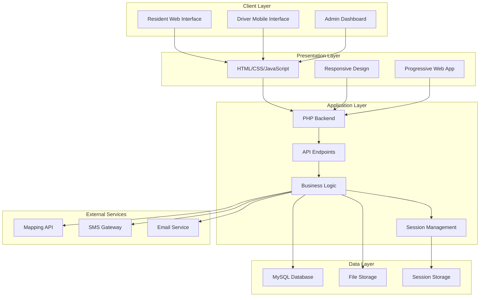
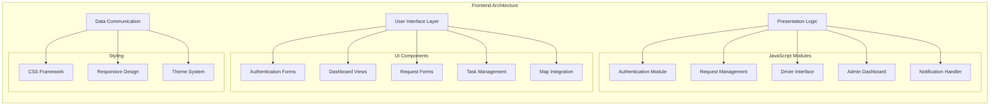
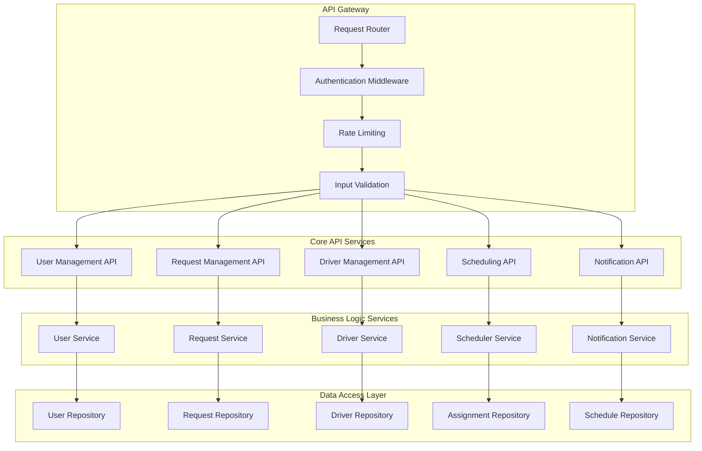
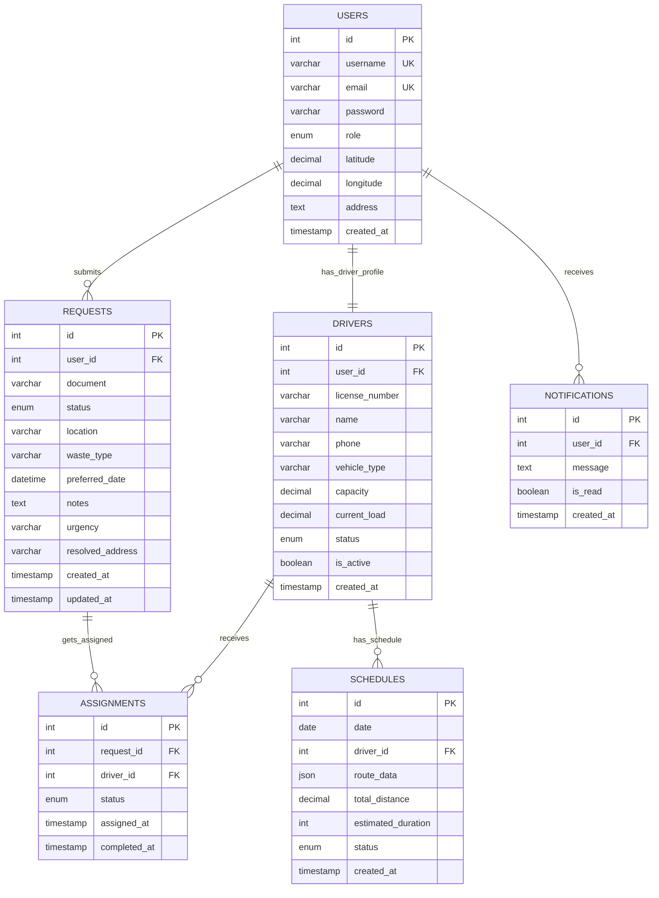
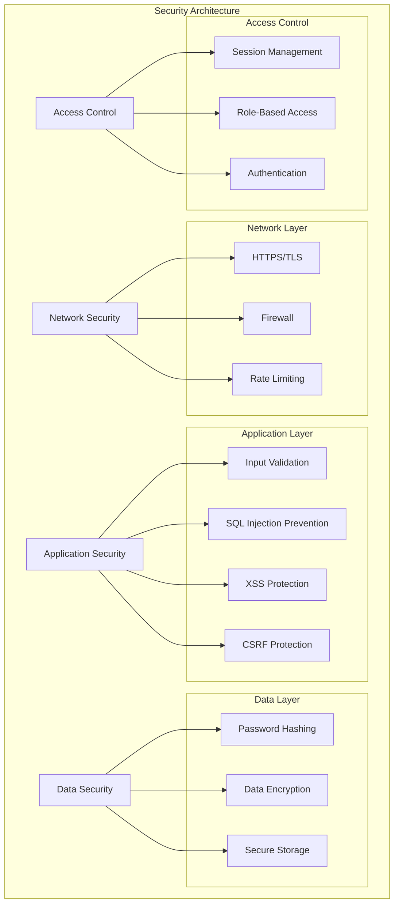
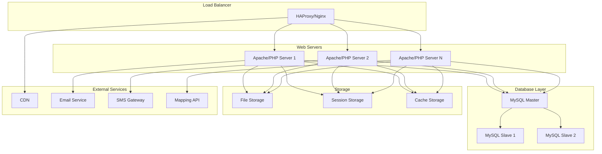
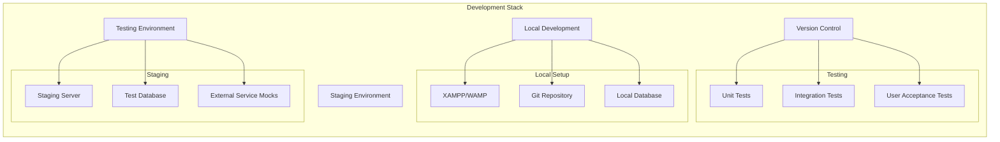
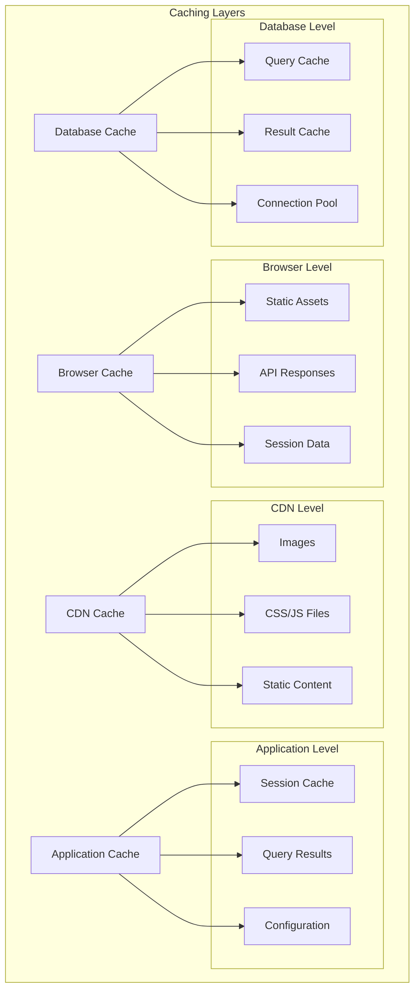
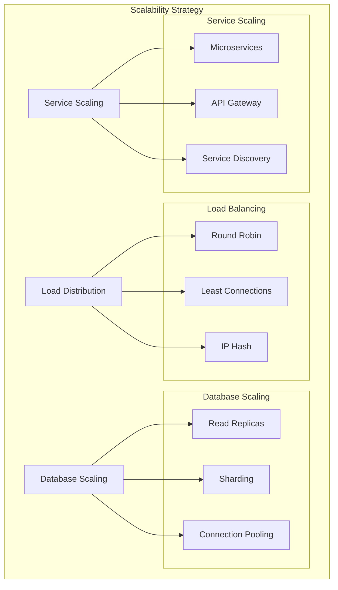
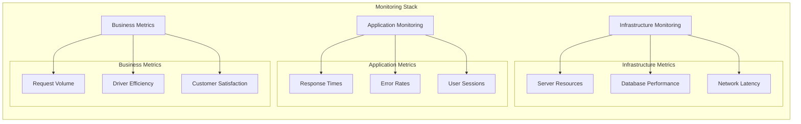

# DRMS System Architecture Documentation

## 1. High-Level System Architecture



## 2. Detailed Component Architecture

### 2.1 Frontend Components



### 2.2 Backend API Architecture



## 3. Database Architecture

### 3.1 Database Schema Overview



### 3.2 Database Indexing Strategy

```sql
-- Primary Indexes
CREATE INDEX idx_users_username ON users(username);
CREATE INDEX idx_users_email ON users(email);
CREATE INDEX idx_users_role ON users(role);

CREATE INDEX idx_requests_user_id ON requests(user_id);
CREATE INDEX idx_requests_status ON requests(status);
CREATE INDEX idx_requests_created_at ON requests(created_at);
CREATE INDEX idx_requests_preferred_date ON requests(preferred_date);

CREATE INDEX idx_drivers_user_id ON drivers(user_id);
CREATE INDEX idx_drivers_status ON drivers(status);
CREATE INDEX idx_drivers_is_active ON drivers(is_active);

CREATE INDEX idx_assignments_request_id ON assignments(request_id);
CREATE INDEX idx_assignments_driver_id ON assignments(driver_id);
CREATE INDEX idx_assignments_status ON assignments(status);

CREATE INDEX idx_notifications_user_id ON notifications(user_id);
CREATE INDEX idx_notifications_is_read ON notifications(is_read);
CREATE INDEX idx_notifications_created_at ON notifications(created_at);
```

## 4. Security Architecture

### 4.1 Security Layers



## 5. Deployment Architecture

### 5.1 Production Environment



### 5.2 Development Environment



## 6. Performance Architecture

### 6.1 Caching Strategy



## 7. Scalability Considerations

### 7.1 Horizontal Scaling



## 8. Monitoring and Logging

### 8.1 Monitoring Architecture



## 9. Technology Stack

### 9.1 Frontend Technologies
- **HTML5**: Semantic markup and structure
- **CSS3**: Styling and responsive design
- **JavaScript (ES6+)**: Client-side interactivity
- **Fetch API**: Asynchronous data communication
- **Leaflet.js**: Map integration and visualization

### 9.2 Backend Technologies
- **PHP 8.0+**: Server-side programming
- **MySQL 8.0**: Relational database management
- **Apache/Nginx**: Web server
- **JSON**: Data interchange format
- **Session Management**: PHP sessions

### 9.3 Development Tools
- **Git**: Version control
- **XAMPP/WAMP**: Local development environment
- **Composer**: Dependency management (if applicable)
- **PHPUnit**: Unit testing framework

### 9.4 External Services
- **Mapping APIs**: Route calculation and visualization
- **SMS Gateway**: Text message notifications
- **Email Services**: Email notifications
- **CDN**: Content delivery network

## 10. Future Architecture Considerations

### 10.1 Microservices Migration
- **Service Decomposition**: Break monolithic application into microservices
- **API Gateway**: Centralized API management
- **Service Discovery**: Dynamic service registration and discovery
- **Container Orchestration**: Docker and Kubernetes deployment

### 10.2 Cloud Migration
- **Cloud Hosting**: AWS, Azure, or Google Cloud Platform
- **Serverless Architecture**: Function-as-a-Service for specific operations
- **Managed Services**: Database, caching, and storage services
- **Auto-scaling**: Automatic resource scaling based on demand

### 10.3 Advanced Features
- **Real-time Communication**: WebSocket integration for live updates
- **Mobile Applications**: Native iOS and Android apps
- **IoT Integration**: Smart waste bin sensors and monitoring
- **Machine Learning**: Predictive analytics and route optimization

This architecture documentation provides a comprehensive technical overview of the DRMS system, including current implementation details and future scalability considerations. 