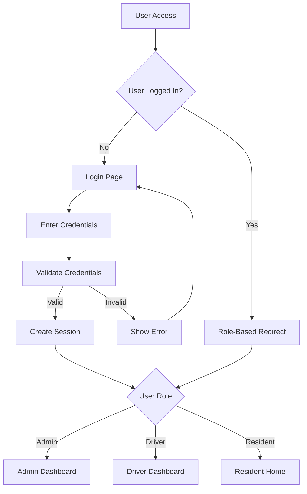
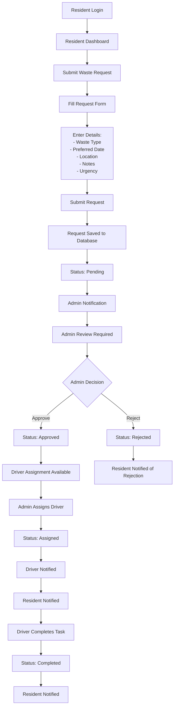
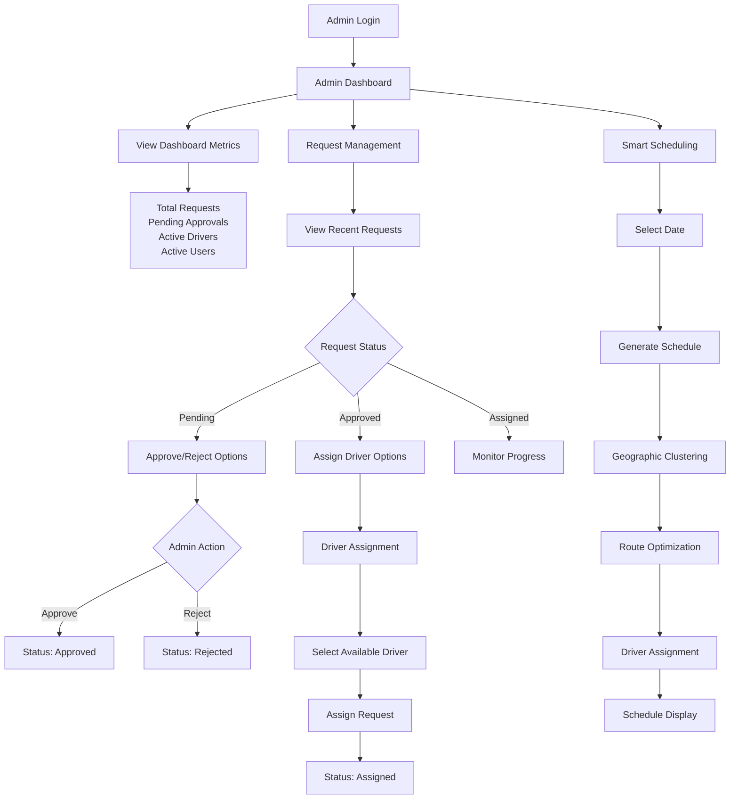
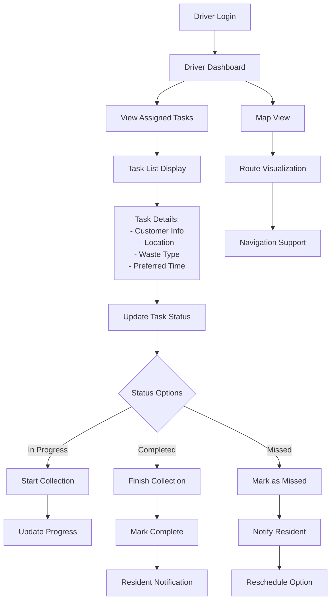
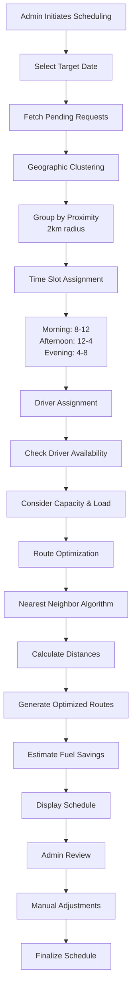
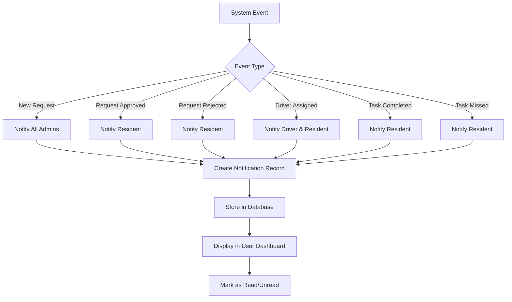
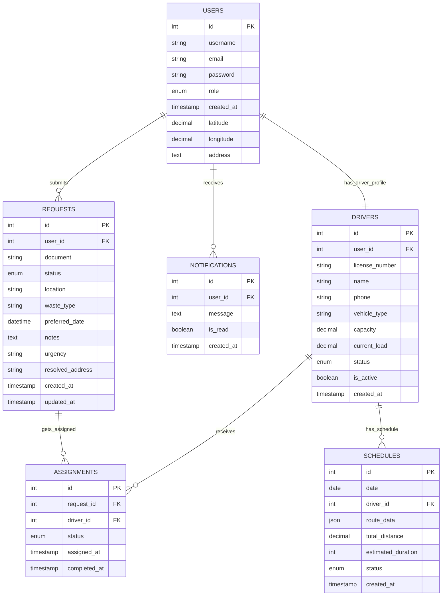
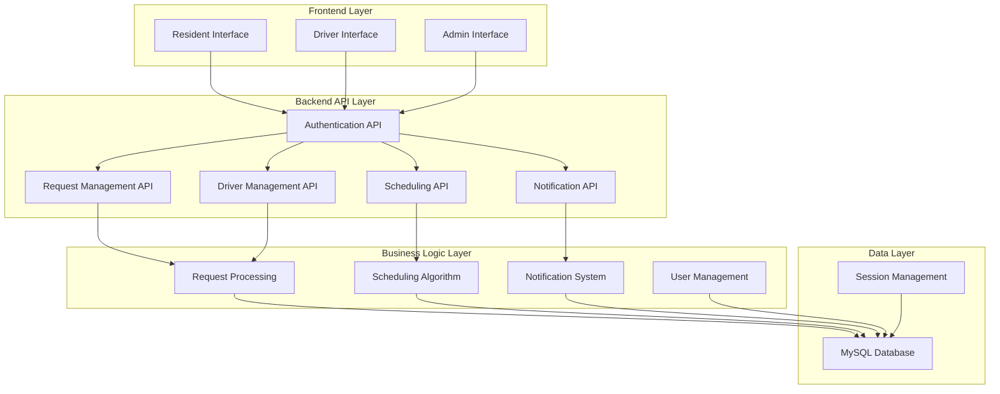

# DRMS System Flow Chart Documentation

## System Overview
The DRMS (Driver Request Management System) is a waste collection management platform with three main user roles: Residents, Drivers, and Administrators.

## 1. User Authentication Flow

## 2. Resident Request Flow

## 3. Admin Management Flow

## 4. Driver Task Management Flow

## 5. Smart Scheduling Algorithm Flow

## 6. Notification System Flow

## 7. Database Entity Relationships

## 8. System Architecture Overview

## Key System Features

### 1. **Role-Based Access Control (RBAC)**
- **Residents**: Submit requests, view status, receive notifications
- **Drivers**: View assigned tasks, update status, access maps
- **Admins**: Approve/reject requests, assign drivers, generate schedules

### 2. **Smart Scheduling Algorithm**
- Geographic clustering by proximity
- Time slot optimization
- Driver capacity management
- Route optimization using nearest neighbor algorithm
- Fuel savings calculation

### 3. **Real-time Notifications**
- Email and in-app notifications
- Status change alerts
- Task assignment notifications
- Missed collection alerts

### 4. **Geographic Features**
- Location-based request processing
- Route visualization
- Distance calculations
- Map integration for drivers

### 5. **Reporting & Analytics**
- Dashboard metrics
- Request statistics
- Driver performance tracking
- Fuel efficiency reports

This flow chart documentation provides a comprehensive view of how the DRMS system operates, from user authentication to task completion, including all the major processes and interactions between different user roles and system components. 